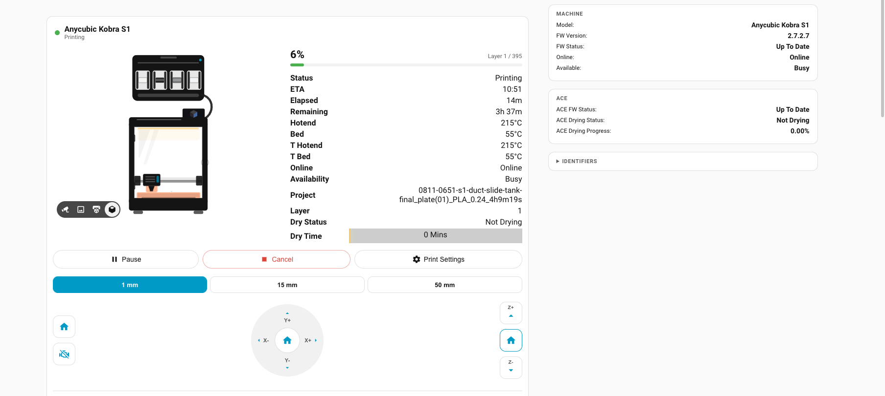
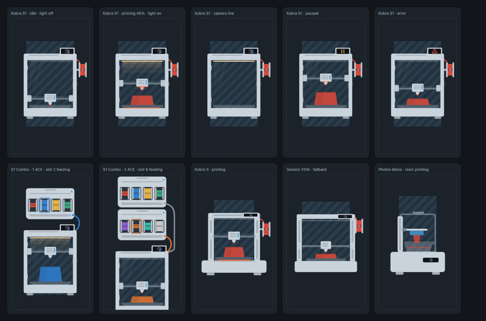
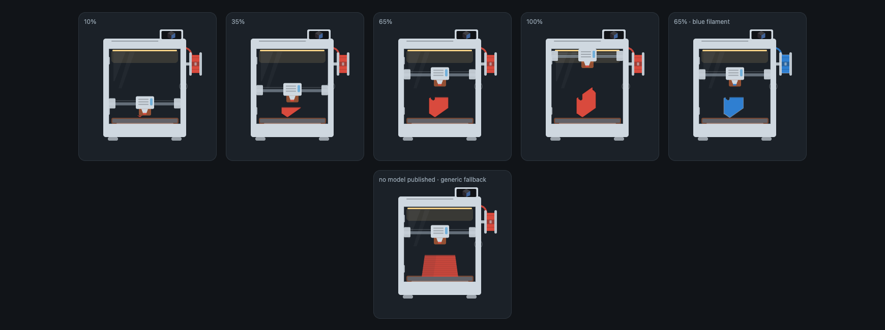
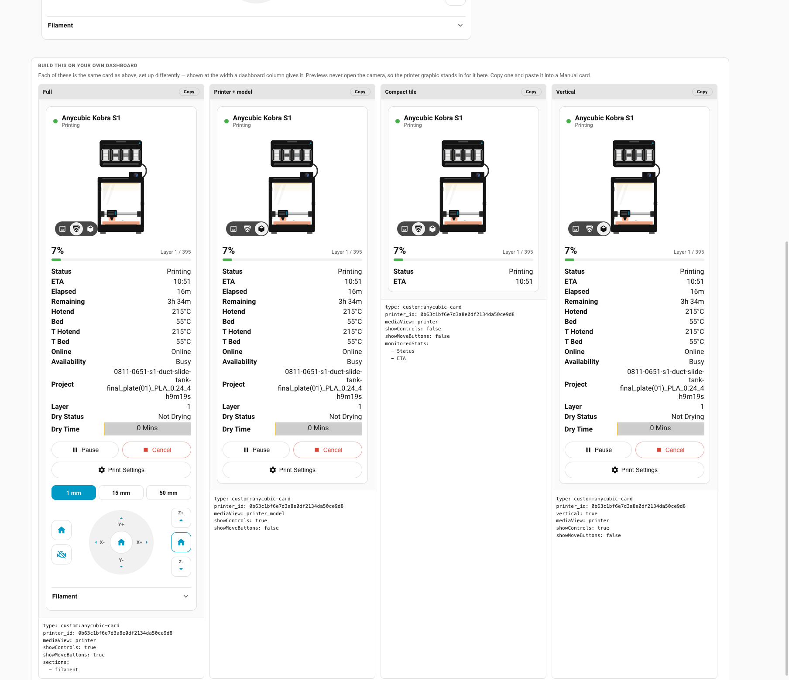
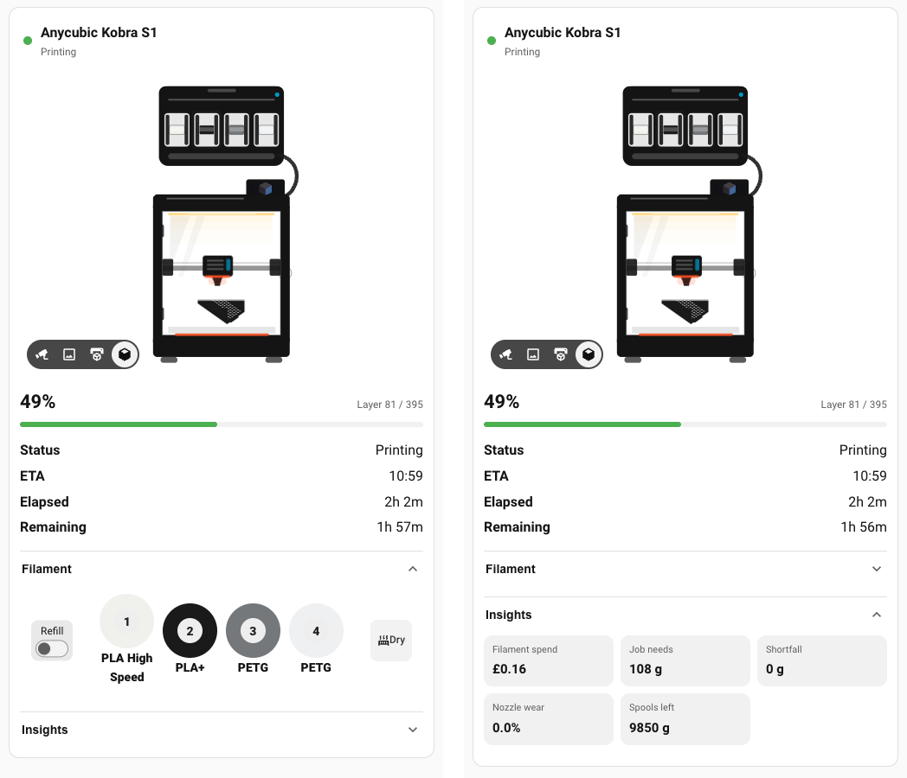

<h1 align="center">Anycubic Cloud &amp; LAN</h1>

<p align="center"><b>Home Assistant integration for Anycubic 3D printers</b></p>

<p align="center">
  Monitor and control your <b>Anycubic Kobra</b> or <b>Photon</b> from Home Assistant —<br>
  through Anycubic's cloud, or <b>directly over your own network</b>.
</p>

<p align="center">
  <a href="https://github.com/Nino6689/hass-anycubic/releases/latest"></a>
  <a href="https://github.com/hacs/default/pull/7780"></a>
  <a href="LICENSE"></a>
  <a href="https://buymeacoffee.com/nino6689"></a>
</p>

---

> ## ⚠️ Commands that move the printer carry real risk
>
> This integration can preheat, jog the axes, home, release the motors, run the fans and dry a
> spool. Those orders were worked out by watching what Anycubic's own slicer sends, not from
> any published API, and they are tested on a **Kobra S1 with an ACE Pro** — the only hardware
> here. Other models are supported by report rather than by verification.
>
> A jog into an unhomed bed, a heater set by an automation while nobody is in the room, a model
> that interprets an order differently — these are possible.
>
> **You install and run this at your own risk.** It is provided as-is, with no warranty and no
> liability for damage to your printer, your prints or anything else — see the
> [licence](LICENSE), sections 15 and 16. Don't leave a printer unattended while you're trying
> these controls, and don't put temperature or movement into an automation until you've watched
> it behave.
>
> If something misbehaves, [open an issue](https://github.com/Nino6689/hass-anycubic/issues) —
> reports from hardware I don't own are the only way this list gets firmer.

---

## What you get

|  |  |
|---|---|
| 🌡️ **Live telemetry** | Nozzle, bed and ACE temperatures, fan speeds, print speed — updating every second while printing |
| 📊 **Job tracking** | Progress, current and total layers, elapsed and remaining time, and a real timestamp ETA |
| 🧵 **Per-slot filament** | Every ACE slot as its own entity, showing material **and colour**, with a spool-shaped icon |
| 🔮 **Run-out warning** | Whether the loaded reel will see the print out — answered within the first few percent, [no slicer estimate needed](#-will-this-print-finish-on-the-loaded-spool) |
| 💷 **Print costs** | Per-job and lifetime spend, in your own currency |
| 🔧 **Nozzle wear** | Abrasive filament tracked separately, because that's what actually wears it out |
| 🎮 **Full control** | Preheat a **cold** printer, jog the axes, release the motors, run the fans, dry a spool, feed and retract — [all as entities](#-controlling-the-printer) |
| 🃏 **A card for your dashboard** | Camera, progress, controls and filament in one place — [nothing to install](#-the-anycubic-card), it's in the card picker |
| 🖼️ **Live preview** | The job preview image, as a camera-style entity |
| 📈 **Lifetime stats** | Total filament used, total print time and print count |
| 📷 **Camera** | The printer's own video, on **either** connection — [WebRTC over the cloud, or the stream straight off the printer locally](#-watching-the-printer) |
| 🔌 **Cloud or local** | Talk to the printer through Anycubic's cloud *or* [directly on your network](#5-optional-talk-to-the-printer-directly) — the local route needs **no account at all** |
| 🔎 **Found automatically** | A printer on your network offers itself in Home Assistant; no address to hunt down |
| 🔐 **Verified connection** | TLS to Anycubic's cloud is properly verified — see [Security](#-security) |

Around **130 entities** per printer, across two devices: the printer, and the ACE as a child device.

---

## Project status

**This is the maintained continuation of Anycubic Cloud for Home Assistant**, listed in the
HACS default catalog since August 2026 — install it by searching HACS, no custom repository
needed.

It began as a fork of [WaresWichall/hass-anycubic_cloud](https://github.com/WaresWichall/hass-anycubic_cloud),
which did all the original work and deserves the credit for it. Upstream's last release was
December 2024 and the author
[stepped back from the project](https://github.com/WaresWichall/hass-anycubic_cloud/issues/33).

> ### 🚚 Still on upstream v0.2.2? You are in the majority — and it is broken.
>
> [Home Assistant's analytics](https://analytics.home-assistant.io/) show **around 80% of
> Anycubic Cloud installs still on 0.2.2** (165 of 206 reporting, August 2026),
> and that version **cannot start on current Home Assistant**: it fails at setup with
> `HTTP 500 "Server got itself in trouble"` — a `paho-mqtt 1.6.1` dependency against the 2.x
> that Core now ships. Upstream is archived, so it will never prompt you to update.
> The fix is a two-minute swap, and **nothing you built on it is lost** — see
> [Moving from v0.2.2](#-moving-from-v022) for exactly what carries over.

What maintenance means here:

- **Compatibility with current HA Core** — the paho-mqtt 2.x / Python 3.13+ breakage is fixed, and future Core breakage is the priority when it happens
- **Issue triage** — bugs get looked at, reproduced where possible, and answered
- **Security fixes** — see [Security](#-security)
- **Upstream first, still** — if @WaresWichall picks the project back up, everything here is theirs to take and this fork happily retires

Not every request becomes a feature. Things needing hardware I don't have, or that Anycubic's
API doesn't expose, are recorded honestly in the [roadmap](#-roadmap) rather than promised.

### Hardware and testing scope

> I own a **Kobra S1 with an ACE Pro**. That is the only hardware every change here is actually
> tested against — the TLS work, the MQTT connection, the entities, the panel.

Everything else in the [supported printers](#supported-printers) list works because upstream or
the community reported it working, not because I verified it. I'll take care not to break those
models, but I can't confirm their behaviour first-hand.

So **bug reports and test results for other models are genuinely useful** — you're my only
visibility into that hardware. And if Anycubic, or anyone with a spare machine, wants a model
properly supported rather than supported-by-inference, a donated printer means it gets tested
for real. Until then I'd rather be upfront about the gap than imply coverage I don't have.

---

## Contents

- [Quick start](#quick-start)
- [🚚 Moving from v0.2.2](#-moving-from-v022)
- [Supported printers](#supported-printers)
- [1. Install](#1-install)
- [2. Get an auth token](#2-get-an-auth-token) — [Slicer](#option-a--slicer-token-recommended) · [Web](#option-b--web-token-easiest) · [Android](#option-c--android-token-advanced)
- [3. Add it to Home Assistant](#3-add-it-to-home-assistant)
- [4. Choose a connect mode](#4-choose-a-connect-mode)
- [5. Talk to the printer directly *(LAN Mode)*](#5-optional-talk-to-the-printer-directly) — [which to choose](#which-should-you-choose) · [what each gives you](#what-each-mode-gives-you)
- [Entities](#entities)
- [🃏 The Anycubic card](#-the-anycubic-card)
- [📷 Watching the printer](#-watching-the-printer)
- [🎮 Controlling the printer](#-controlling-the-printer)
- [🧵 Filament and the ACE](#-filament-and-the-ace)
- [Filament remaining *(estimated)*](#filament-remaining-estimated)
- [🔮 Will this print finish on the loaded spool?](#-will-this-print-finish-on-the-loaded-spool)
- [💷 What your prints cost](#-what-your-prints-cost)
- [🔧 Nozzle wear](#-nozzle-wear)
- [📚 Spool inventory](#-spool-inventory)
- [📱 ReSpool — write your own spool tags *(beta)*](#-respool--an-ios-app-for-writing-spool-tags-beta)
- [Automation examples](#automation-examples)
- [Troubleshooting](#troubleshooting)
- [🔐 Security](#-security)
- [📦 Changes from upstream](#-changes-from-upstream)
- [🧭 Roadmap](#-roadmap)
- [Translating](#translating)
- [Credits](#credits)

---

## Quick start

Know your way around HACS? Here's the speed run:

[](https://my.home-assistant.io/redirect/hacs_repository/?owner=Nino6689&repository=hass-anycubic_cloud&category=integration)

1. Click the button above (or search HACS for **Anycubic**) → **Download**
2. Restart Home Assistant
3. **Settings → Devices & services → Add integration** → **Anycubic Cloud & LAN**
4. Choose how to connect:
   - **Directly on your network** — needs [LAN Mode](#5-optional-talk-to-the-printer-directly) on the printer and **nothing else**. No account, no token.
   - **Anycubic account** — grab a token via the [slicer method](#option-a--slicer-token-recommended) or the [web console snippet](#option-b--web-token-easiest)
5. Select your printer

If your printer is on the network, Home Assistant may well have **found it already** —
check Settings → Devices & services for a discovered Anycubic printer.

Otherwise the step-by-step below explains everything.

---

## 🚚 Moving from v0.2.2

The upstream integration and this one share the **same domain** (`anycubic_cloud`) and the
**same entity unique-id scheme**, so Home Assistant treats the upgrade as an update of the
integration it already has, not a new one. Concretely:

| | Carries over? | Why |
|---|---|---|
| **Entity ids** | ✅ Yes | Same `unique_id` derivation, so `sensor.anycubic_kobra_s1_job_progress` stays exactly that |
| **History & statistics** | ✅ Yes | Follows the entity id |
| **Automations & scripts** | ✅ Yes | They reference entity ids, which do not change |
| **Dashboards** | ✅ Yes | Same reason; the [new card](#-the-anycubic-card) is extra, not a replacement |
| **Your token** | ✅ Yes | The config entry loads as-is; region defaults to International |
| **Custom entity names** | ✅ Yes | Registry overrides are keyed by unique id |

**Steps**

1. In HACS, remove the old **Anycubic Cloud** repository entry if it points at
   `WaresWichall/hass-anycubic_cloud`, and add this one — it is in the **default catalog**, so
   just search "Anycubic". Do **not** delete the integration from Settings → Devices; leave the
   config entry alone.
2. Download, restart Home Assistant.
3. That's it. The entry loads, the entities repopulate under their old ids, and the sidebar
   panel appears with the [showcase](#-build-this-on-your-own-dashboard).

**New since 0.2.2 that is worth a look on day one:** the
[animated printer card](#-the-anycubic-card), [filament tracking with weights and cost](#-filament-and-the-ace),
[direct LAN connection](#5-optional-talk-to-the-printer-directly), the cloud camera, and
[print controls](#-controlling-the-printer). The full list is in
[Changes from upstream](#-changes-from-upstream).

> **If you have a second ACE**, it was invisible on 0.2.2 (and on early 2.x for fresh installs).
> It appears in the Filament section from 2.1.0. If it doesn't, please
> [say so](https://github.com/Nino6689/hass-anycubic/issues) — that path has been fixed twice.

---

## Supported printers

**✅ Verified here** — the hardware I own and test against:

- **Kobra S1**, including the **ACE Pro**

**📣 Reported working** by upstream and the community — these should work, but I can't test them:

| | |
|---|---|
| Kobra 3 Combo | Kobra 2 / 2 Max / 2 Pro |
| Photon Mono M5s *(basic)* | M7 Pro *(basic)* |

**🧪 Confirmed by owners** — reports from people running the hardware, in their words:

<!-- TESTED-PRINTERS:START -->
| Printer | Unit | Connection | Confirmed working | Report |
| --- | --- | --- | --- | --- |
| Kobra S1 | ACE Pro | Both | Temperatures and job progress, Every ACE slot, with material and colour, Filament remaining +5 more | [#16](https://github.com/Nino6689/hass-anycubic/discussions/16) |
| Kobra S1 Max | ACE 2 Pro | Cloud | Temperatures and job progress | [#18](https://github.com/Nino6689/hass-anycubic/discussions/18) |
| Kobra X | ACE (model 40002) | Local only, no Anycubic account | Temperatures and job progress, Every ACE slot, with material and colour, Filament remaining +2 more | [#19](https://github.com/Nino6689/hass-anycubic/discussions/19) |
<!-- TESTED-PRINTERS:END -->

**Ran it on your printer?** [Post a report](https://github.com/Nino6689/hass-anycubic/discussions)
— there's a short form, and it takes a minute. Reports that things **work** matter as much as
reports that they don't: a Kobra S1 with an ACE Pro is the only machine here, so everything else
on this page rests on what people tell me. The table above is built from those reports.

Something misbehaving rather than merely untested?
[Open an issue](https://github.com/Nino6689/hass-anycubic/issues) instead.

---

## 1. Install

### Via HACS (recommended)

This integration is in the **HACS default catalog**, so no custom repository is needed:

[](https://my.home-assistant.io/redirect/hacs_repository/?owner=Nino6689&repository=hass-anycubic_cloud&category=integration)

1. Click the button above, or open **HACS** and search for **Anycubic**
2. **Download**
3. **Restart Home Assistant**

<details>
<summary>Not showing up in HACS yet?</summary>

HACS reads a data feed that is rebuilt periodically, so a newly added repository can take up to
a day or so to become searchable. In the meantime, add it manually:

**HACS** → **⋮** (top right) → **Custom repositories** → add
`https://github.com/Nino6689/hass-anycubic` with category **Integration**.

You can remove the custom entry once it appears in the catalog on its own.
</details>

### Manually

Grab the latest [release zip](https://github.com/Nino6689/hass-anycubic/releases/latest),
extract `custom_components/anycubic_cloud/` into your HA `config/custom_components/` directory,
and restart.

---

## 2. Get an auth token

This integration **never asks for your Anycubic email or password** — Home Assistant can't
perform the Anycubic OAuth flow with its captchas and 2FA. Instead you take a **token** from
somewhere you're already signed in, and paste it in.

Pick **one** of the three options.

> 💡 **Want the one‑click way?** The [`tools/`](tools/README.md) folder has a no‑terminal
> browser bookmarklet and double‑click helpers for macOS and Windows that grab the token for
> you and explain, in plain language, exactly what they do. If terminals make you nervous,
> start there.

### Option A — Slicer token *(recommended)*

> ⚡ **Why this one?** Anycubic blocks MQTT for tokens taken from the website. Only slicer tokens
> give real-time status — temperatures, progress and layers updating every second instead of
> every minute — **plus the control buttons**.

You'll need [Anycubic Slicer Next](https://www.anycubic.com/pages/anycubic-slicer-next), signed
in once via **Settings → Account**.

<details>
<summary><b>A1. If your slicer config is plain text</b> — older builds</summary>

<br>

Sign in once, **quit the slicer**, then run:

**macOS** — copies the token straight to your clipboard, nothing to download:

```bash
plutil -extract anycubic_cloud.access_token raw -o - ~/Library/Application\ Support/AnycubicSlicerNext/AnycubicSlicerNext.conf | tr -d '\n' | pbcopy && echo "Token copied to clipboard"
```

`plutil` is part of macOS, so this works on a clean machine with nothing installed.

<details>
<summary>Prefer a double-click icon?</summary>

<br>

Run this once to put a working helper on your Desktop:

```bash
curl -fsSL https://raw.githubusercontent.com/Nino6689/hass-anycubic/main/tools/get-anycubic-token-macos.command -o ~/Desktop/AnycubicToken.command && chmod +x ~/Desktop/AnycubicToken.command && xattr -c ~/Desktop/AnycubicToken.command && echo "Saved to your Desktop"
```

Double-click `AnycubicToken.command` any time to refresh your token.

The `chmod` and `xattr` parts matter: GitHub does not preserve the executable
flag, and anything downloaded through a browser is quarantined by Gatekeeper.
Without them, double-clicking just opens the file in TextEdit — which is
exactly what happens if you download it by hand.

</details>

**Windows** *(PowerShell)*

```powershell
$conf = "$env:APPDATA\AnycubicSlicerNext\AnycubicSlicerNext.conf"
(Get-Content $conf | ConvertFrom-Json).anycubic_cloud.access_token
```

You'll get a long string (~1200 characters) starting with `eyJ…`. Copy the whole thing.

</details>

<details>
<summary><b>A2. If your slicer config is encrypted</b> — newer builds ⚠️</summary>

<br>

Newer Slicer Next builds **encrypt the `anycubic_cloud` section**. If the command above returns
nothing, or the file looks like this:

```json
"anycubic_cloud": {
    "AbC1dEf2GhI3jK4l5MnO6w==": true,
    "Zy9XwV8uTs7RqP6oNmL5kA==": "QWxhYmFzZTY0ZW5jcnlwdGVkdG9rZW4uLi4="
}
```

…then the key names and the token are AES-encrypted and base64-encoded. The key lives inside the
slicer's `common_encrypt.dll` and isn't exported, so **the file cannot be decrypted** — there is
nothing this integration can do to read it. Pasting the encrypted blob will correctly be
rejected as invalid authentication.

The slicer does decrypt the token into memory to sign in, so you can recover it from the running
process. This is a standard Windows feature and nothing leaves your machine. Credit to
[@simo26246 in upstream #67](https://github.com/WaresWichall/hass-anycubic_cloud/issues/67).

1. Open Slicer Next and make sure it's **signed in**
2. **Ctrl+Shift+Esc** → **Details** tab → right-click `AnycubicSlicerNext.exe` (the larger of the two) → **Create dump file**
3. Run this in PowerShell — **not as Administrator**, which fails with an out-of-memory error.
   It verifies each candidate's RSA signature against Anycubic's published keys and copies the
   newest valid, unexpired one:

   ```powershell
   $dmp = Get-ChildItem "$env:TEMP\AnycubicSlicerNext*.DMP" | Sort-Object LastWriteTime -Descending | Select-Object -First 1
   if (-not $dmp) { throw "No dump file found in $env:TEMP" }

   $keys = (Invoke-RestMethod -Uri "https://uc.makeronline.com/.well-known/jwks" -Headers @{ "User-Agent" = "Mozilla/5.0" }).keys

   function ConvertFrom-B64Url([string]$s) {
       [Convert]::FromBase64String($s.Replace('-', '+').Replace('_', '/').PadRight($s.Length + (4 - $s.Length % 4) % 4, '='))
   }

   $bytes = [IO.File]::ReadAllBytes($dmp.FullName)
   $rx = [regex]'(eyJ[A-Za-z0-9_-]{10,})\.([A-Za-z0-9_-]{10,})\.([A-Za-z0-9_-]{100,})'
   $seen = @{}
   $found = @()

   foreach ($enc in @([Text.Encoding]::GetEncoding(28591), [Text.Encoding]::Unicode)) {
       foreach ($m in $rx.Matches($enc.GetString($bytes))) {
           $header, $payload, $rawSig = $m.Groups[1].Value, $m.Groups[2].Value, $m.Groups[3].Value
           if ($seen.ContainsKey($m.Value)) { continue }
           $seen[$m.Value] = 1

           try { $claims = [Text.Encoding]::UTF8.GetString((ConvertFrom-B64Url $payload)) | ConvertFrom-Json } catch { continue }
           if ($claims.tokenType -ne 'access-token') { continue }
           if (-not ($claims.id -and $claims.sub -and $claims.email)) { continue }

           $signed = [Text.Encoding]::ASCII.GetBytes("$header.$payload")

           foreach ($key in $keys) {
               $modulus = ConvertFrom-B64Url $key.n
               # A signature is exactly as long as the modulus, so cut the
               # match down to size -- see the note below.
               $sigChars = [int][Math]::Ceiling($modulus.Length * 8 / 6)
               if ($rawSig.Length -lt $sigChars) { continue }
               $sigText = $rawSig.Substring(0, $sigChars)

               $rsa = [Security.Cryptography.RSA]::Create()
               $params = New-Object Security.Cryptography.RSAParameters
               $params.Modulus = $modulus
               $params.Exponent = ConvertFrom-B64Url $key.e
               $rsa.ImportParameters($params)

               $ok = $rsa.VerifyData($signed, (ConvertFrom-B64Url $sigText),
                   [Security.Cryptography.HashAlgorithmName]::SHA256,
                   [Security.Cryptography.RSASignaturePadding]::Pkcs1)
               $rsa.Dispose()

               if ($ok) {
                   $expiry = [DateTimeOffset]::FromUnixTimeSeconds([long]$claims.exp)
                   if ($expiry -gt [DateTimeOffset]::UtcNow) {
                       $found += [pscustomobject]@{ Token = "$header.$payload.$sigText"; Issued = [long]$claims.iat; Expiry = $expiry }
                   }
                   break
               }
           }
       }
   }

   if (-not $found) { throw "No valid, unexpired access token found in the dump." }

   $best = $found | Sort-Object Issued -Descending | Select-Object -First 1
   Set-Clipboard $best.Token
   "SIGNATURE VALID"
   "Token length: $($best.Token.Length)"
   "Valid until:  $($best.Expiry.ToString('yyyy-MM-dd HH:mm')) UTC"
   "Access token copied to clipboard - paste it into Home Assistant."
   ```

4. Paste into Home Assistant

> 💡 **Why this replaced the old one-liner.** The previous script took the **longest** match, which
> is precisely the wrong choice: a regex searching raw memory keeps matching base64 past the end
> of the signature, so the longest candidate is the one carrying trailing junk. It decodes
> perfectly, has correct claims, and the server refuses it with `User does not exist` — which
> cost [#8](https://github.com/Nino6689/hass-anycubic/issues/8) a full day. Tested against a dump
> with 8 stray characters: the old script returned an unusable 1211-char token, this one the
> correct 1203. Since **v1.4.7** the integration also trims stray characters itself, so a slightly
> over-long paste is repaired rather than rejected.

> 🔐 **Delete the `.DMP` file afterwards** — it contains all your live tokens in clear text. Only
> ever do this for your own account, on your own machine.

</details>

<details>
<summary><b>A3. Recovering the token on macOS</b> — encrypted config, Apple silicon 🍎</summary>

<br>

The same encryption applies on macOS, but there's no Task Manager to dump from. Worked out and
contributed by [**@hausch1ld** in #8](https://github.com/Nino6689/hass-anycubic/issues/8) — the
only macOS method anyone has written down.

The approach: make an ad-hoc-signed copy of the slicer (the shipped one refuses a debugger), run
it under `lldb`, and save a core dump once it has decrypted the token into memory.

1. Open Slicer Next, **sign in**, then quit it.

2. Create a debuggable copy:

   ```bash
   rm -rf "/private/tmp/AnycubicSlicerNext-Debug.app"
   ditto "/Applications/AnycubicSlicerNext.app" "/private/tmp/AnycubicSlicerNext-Debug.app"
   codesign --force --deep --sign - --timestamp=none "/private/tmp/AnycubicSlicerNext-Debug.app"
   ```

3. Launch it under the debugger, then type `run` at the `(lldb)` prompt:

   ```bash
   /usr/bin/lldb -- "/private/tmp/AnycubicSlicerNext-Debug.app/Contents/MacOS/AnycubicSlicerNext"
   ```

4. In the slicer, open your workbench and check you're signed in and your printer is listed.

5. Back in Terminal press **Ctrl+C** (not Cmd) to pause the app, then:

   ```
   process save-core /private/tmp/AnycubicSlicerNext.core
   process detach
   quit
   ```

6. Extract the token — this verifies each candidate's RSA signature against Anycubic's published
   keys and copies the newest valid, unexpired one to your clipboard:

   ```bash
   python3 - <<'PY'
   import base64, datetime, hashlib, json, mmap, re, subprocess, urllib.request
   from pathlib import Path

   CORE = Path("/private/tmp/AnycubicSlicerNext.core")
   JWKS = "https://uc.makeronline.com/.well-known/jwks"
   PREFIX = bytes.fromhex("3031300d060960864801650304020105000420")

   def b64d(value):
       if isinstance(value, bytes):
           value = value.decode()
       return base64.urlsafe_b64decode(value + "=" * (-len(value) % 4))

   req = urllib.request.Request(JWKS, headers={"User-Agent": "Mozilla/5.0"})
   keys = json.load(urllib.request.urlopen(req, timeout=15))["keys"]

   pattern = re.compile(rb"(eyJ[A-Za-z0-9_-]{10,})\.([A-Za-z0-9_-]{10,})\.([A-Za-z0-9_-]{100,})")
   valid = []

   with CORE.open("rb") as file, mmap.mmap(file.fileno(), 0, access=mmap.ACCESS_READ) as mem:
       for match in pattern.finditer(mem):
           header, payload, raw_signature = match.groups()
           try:
               claims = json.loads(b64d(payload))
           except Exception:
               continue
           if claims.get("tokenType") != "access-token":
               continue
           if not all(claims.get(k) for k in ("id", "sub", "email")):
               continue
           for key in keys:
               n = int.from_bytes(b64d(key["n"]), "big")
               e = int.from_bytes(b64d(key["e"]), "big")
               size = (n.bit_length() + 7) // 8
               signature_text = raw_signature[: (size * 8 + 5) // 6]
               try:
                   signature = int.from_bytes(b64d(signature_text), "big")
               except Exception:
                   continue
               digest = PREFIX + hashlib.sha256(header + b"." + payload).digest()
               expected = b"\x00\x01" + b"\xff" * (size - len(digest) - 3) + b"\x00" + digest
               if pow(signature, e, n).to_bytes(size, "big") == expected:
                   if claims.get("exp", 0) > datetime.datetime.now().timestamp():
                       valid.append((claims.get("iat", 0), b".".join((header, payload, signature_text)).decode(), claims))
                   break

   if not valid:
       raise SystemExit("Could not find a valid access-token")

   _, token, claims = max(valid, key=lambda item: item[0])
   subprocess.run(["pbcopy"], input=token, text=True, check=True)
   print("SIGNATURE VALID")
   print("Token length:", len(token))
   print("Valid until:", datetime.datetime.fromtimestamp(claims["exp"], datetime.timezone.utc).strftime("%Y-%m-%d %H:%M UTC"))
   print("Access token copied to clipboard")
   PY
   ```

7. Paste it into Home Assistant, then clean up:

   ```bash
   rm -rf "/private/tmp/AnycubicSlicerNext-Debug.app" "/private/tmp/AnycubicSlicerNext.core"
   pbcopy < /dev/null
   ```

> 💡 **Why the signature length matters.** A regex searching raw memory keeps matching base64
> characters past the end of the signature, so the token comes out **too long** — it decodes
> perfectly, has correct claims, and the server still refuses it with `User does not exist`. The
> key's modulus says exactly where a signature ends, which is what the `(size * 8 + 5) // 6`
> above is for. Since **v1.4.7** the integration trims stray trailing characters itself, so a
> slightly over-long paste is repaired rather than rejected.

> 🔐 **Delete the core file afterwards** — it contains all your live tokens in clear text.

</details>

Tokens last **90 days** (verified from the token's own expiry claim) and may rotate. Home
Assistant warns you in a Repair notice a fortnight before yours lapses, so you get a chance to
replace it before anything breaks — just repeat the steps. Running the slicer and HA signed in at the same time works fine.

### Option B — Web token *(easiest)*

> ⚠️ **Trade-off:** web tokens are polling only — state updates every ~60 seconds instead of in
> real time, and the control buttons won't work. Fine for "is it printing?", not for watching the
> temperature curve.

1. Open <https://cloud-universe.anycubic.com/file> and sign in
2. Open **Developer Tools** (F12) → **Console**
3. Run:

   ```js
   window.localStorage["XX-Token"]
   ```

4. Copy the value **without the surrounding quotes** (~238 characters)

> Getting `undefined`? You're on a freshly-opened tab that redirected through OAuth. Read it from
> the tab you're **already signed in on**.

### Option C — Android token *(advanced)*

Requires extracting a token *and* a `device_id` from the Android app's network traffic, via
[mitmproxy](https://mitmproxy.org/) or [HTTP Toolkit](https://httptoolkit.com/). Considerably
more involved, and not recommended without a specific reason.

---

## 3. Add it to Home Assistant

1. **Settings → Devices & services → + Add integration**
2. Search **Anycubic**
3. Pick the **auth mode** matching your token (Slicer / Web / Android)
4. Paste the token — and **Device ID** too, for Android
5. Choose which printers to track

You'll get the printer device, the ACE as a child device, and the **Anycubic card** ready to add
to any dashboard — see [the card](#-the-anycubic-card). A sidebar panel comes with it.

---

## 4. Choose a connect mode

MQTT is what gives sub-second updates. Staying connected permanently puts a little extra load on
Anycubic's broker, so you choose when it's on:
**Settings → Devices & services → Anycubic Cloud & LAN → Configure**.

| Mode | MQTT connects |
|---|---|
| **Printing only** *(default)* | While a print is running |
| **Printing & drying** | …and while the ACE is drying filament |
| **Device online** | Whenever the printer is powered on |
| **Always** | All the time — best for watching an idle printer |
| **Never** | Polling only, like web auth |

**Need it on right now?** Turn on `switch.<printer>_manual_mqtt_connection_enabled`, press
`button.<printer>_refresh_mqtt_connection`, and `binary_sensor.<printer>_mqtt_connection_active`
should come on within 5–15 seconds.

---

## 5. Optional: talk to the printer directly

The printer can run its own MQTT broker on your network, so Home Assistant talks to it without
Anycubic's cloud in the middle. Turn it on under
**Settings → Devices & services → Anycubic Cloud & LAN → Configure → Local connection (LAN Mode)**.

> [!CAUTION]
> **Switching LAN Mode on removes the printer from your Anycubic account, and switching it back off
> does not restore it.** Read this before you flip it.
>
> Confirmed on a Kobra S1 (firmware 2.7.2.7): with LAN Mode on, the cloud reports the printer as
> deleted (`code 1007`) and the account lists **zero printers**. Turning LAN Mode back off is not
> enough, and **neither is a power cycle** — both were tested. The printer has to be **added again
> in the Anycubic app**, as though it were new.
>
> **The good news:** re-pairing is clean. Tested end to end — the printer came back with the *same*
> cloud id, the integration picked it up with no reconfiguring, and all 84 entities reattached with
> **zero duplicates and zero orphans**. Entities are keyed to the printer's MAC rather than its cloud
> record, which is what makes that work. If yours does come back under a different id, use
> **Reconfigure → Change Printer(s)** to select it.
>
> This is the printer's behaviour, not the integration's. It is the reason a local-first project
> like [anycubic_ha_local](https://github.com/chrisfore/anycubic_ha_local) may suit you better if
> you never want the cloud at all.

**Switch LAN Mode on at the printer first**, then enable it here and give the printer's address. The
handshake runs before the setting is saved, so if the printer is still in cloud mode you're told so
rather than ending up with nothing connected. Give the printer a fixed address on your router while
you're there.

### Which should you choose?

**Most people should stay on cloud.** It is the default for good reason: everything works, nothing
has to be re-paired, and the file library is genuinely useful. Local is for people who have a
specific reason to want it.

> **Pick cloud if** you upload sliced files from your computer, you like browsing the printer's file
> library from Home Assistant, or you simply want the thing that works with the fewest surprises.
>
> **Pick local if** your printer is on an isolated VLAN with no internet, you want camera
> snapshots and recording, you don't trust a cloud service to still be there next year, or you
> object to your printer phoning home at all.

### What each mode gives you

**Both modes give you the core of it** — live temperatures, every ACE slot with its material and
colour, per-slot filament remaining, the chamber light, printer status, and every control that acts
on the printer itself.

| | ☁️ Cloud | 🏠 Local |
|---|---|---|
| **Live telemetry** — nozzle, bed, ACE temps and humidity | ✓ | ✓ |
| **Per-slot filament** — material, colour, and how much is left | ✓ | ✓ |
| **Print controls** — pause, resume, cancel, drying, speed | ✓ | ✓ |
| **Chamber light** | ✓ | ✓ |
| **Head position** — X/Y/Z *(on request)* | ✓ | ✓ |
| **Job tracking** — progress, ETA, layers | ✓ | ✓ |
| Update speed | **Sub-second** push while MQTT is connected | Polled every ~15 s |
| Works with no internet | ✗ | **✓** |
| Survives Anycubic changing or withdrawing their API | ✗ | **✓** |
| Keeps working if your token expires | ✗ | **✓** — no token involved |
| **📷 Camera — live view** | **✓** — WebRTC | **✓** — the printer's own stream |
| **📷 Camera — snapshots and recording** | ✗ | **✓** |
| **🤖 AI / foreign-object detection state** | ✗ | **✓** |
| Capability map in diagnostics | ✗ | **✓** |
| **📁 File library** — browse, upload, print from cloud | **✓** | ✗ |
| **Job preview image** | **✓** | ✗ |
| **Lifetime totals** — filament used, print count | **✓** | ✗ |
| Multiple printers on one account | **✓** | One entry per printer |
| Reachable away from home | **✓** | Local network only |

**The honest summary:** local trades Anycubic's file library, the job thumbnail and your lifetime
counters for a camera, independence from a cloud service, and a printer that keeps working when
your internet doesn't. Everything the printer itself knows, you get either way — **including
filament tracking**, which is the feature most people install this for.

**Switching back and forth** is a single page: **Settings → Devices & services → Anycubic Cloud & LAN →
⋯ → Reconfigure → Connection**. Change it at the printer first, then match it here. Your entity IDs
are the same in both modes, so history and automations carry across.

### Where the local connection is up to

Confirmed end to end on a Kobra S1 running firmware 2.7.2.7. The handshake, the local broker, ACE
data, the capability map and the camera are all proved against real hardware.

**A printer running local-only gets its full working entity set** — temperatures, all four ACE
slots with materials and colours, filament remaining, head position, the camera, the chamber light
and printer status. Verified with the cloud actively reporting the printer as deleted.

What stays unavailable, and why:

| | |
|---|---|
| Cloud file library, uploads, print history, job preview | Cloud services by nature. The printer has no idea they exist |
| Lifetime totals — filament used, print count | Kept by your Anycubic account, not the printer |
| Job entities — progress, ETA, layers, elapsed | Only meaningful while printing, exactly as on the cloud connection |

Everything the printer itself knows, you get.

> [!NOTE]
> Other models in the Kobra 3 / S1 family speak the same protocol but have not been tried —
> [a report either way](https://github.com/Nino6689/hass-anycubic/issues/new/choose) is genuinely
> useful.

**Want local only, with no Anycubic account at all?** That's a different shape of thing, and
[chrisfore/anycubic_ha_local](https://github.com/chrisfore/anycubic_ha_local) does it properly —
it's local-first by design, needs no cloud login, and documented the handshake this feature is built
on. Worth a look if the cloud side is of no interest to you.

---

## Entities

All names below are prefixed with your printer, e.g. `sensor.anycubic_kobra_s1_job_progress`.

> The ACE is its own device, so **its** entities are prefixed with the ACE's name instead —
> `sensor.anycubic_kobra_s1_ace_pro_ace_slot_1_filament_remaining`, not the printer's name.
> Check the entity list rather than assembling ids by hand.

<details open>
<summary><b>🖨️ Printer device</b></summary>

<br>

| Group | Entities |
|---|---|
| **Job** | `job_name`, `job_state`, `job_progress`, `job_current_layer`, `job_total_layers`, `job_time_elapsed`, `job_time_remaining`, `job_eta`, `job_filament_used`, `job_z_thickness`, `job_speed_mode` |
| **Status** | `current_status`, `printer_online`, `is_busy`, `is_available`, `job_in_progress`, `job_complete`, `job_failed`, `job_paused`, `mqtt_connection_active` |
| **Temperatures** | `nozzle_temperature`, `hotbed_temperature`, `target_nozzle_temperature`, `target_hotbed_temperature` |
| **Speeds & fans** | `print_speed`, `fan_speed`, `auxiliary_fan_speed`, `job_speed_mode` — all the printer's own readings, reported while it prints, so they read unavailable on an idle machine. `job_speed_mode` shows the mode's **name** where the cloud has published one and its **number** otherwise; either way the number is on the entity as `print_speed_mode_code` |
| **Lifetime** | `total_material_used` (kg), `total_print_time`, `total_print_count` |
| **Controls** | `printer_light` — unavailable until the printer has reported a light, which it only does over MQTT — plus `pause_print`, `resume_print`, `cancel_print`, `manual_mqtt_connection_enabled`, `refresh_mqtt_connection` |
| **Files** | `file_list_local`, `file_list_usb_disk`, `file_list_cloud` — each reports a **file count**, with the listing in its attributes — and their request buttons |
| **Position** | `head_position_x`, `head_position_y`, `head_position_z`, and a `request_head_position` button. The printer only reports when asked |
| **External spool** | `external_spool_material`, `external_spool_loaded` — for printers fed from a single external holder rather than the ACE |
| **Other** | `job_preview` image, `printer_firmware` update |

</details>

<details open>
<summary><b>🧵 ACE device</b></summary>

<br>

| Group | Entities |
|---|---|
| **Slots** | `ace_slot_1` – `ace_slot_4`, `ace_loaded_slot` |
| **Filament left** | `ace_slot_N_filament_remaining`, `ace_slot_N_filament_remaining_percent`, `ace_slot_N_spool_weight`, `ace_slot_N_reset_spool` — see [Filament remaining](#filament-remaining-estimated) |
| **Unit** | `ace_current_temperature`, `ace_box_fan_level`, `ace_spools`, `ace_run_out_refill`, `refresh_ace_spools`, `ace_firmware` update |
| **Drying** | `drying_active`, `drying_target_temperature`, `drying_remaining_time`, `drying_total_duration`, `drying_stop` |

</details>

Temperature and duration sensors carry the right device classes, so they graph properly and
follow your °C / °F preference. `job_eta` is a genuine **timestamp** entity, so it renders as
local time and works directly in automations.

Anything marked as reported only on request, along with filament-remaining and the external
holder, is **disabled by default** — enable what you want in **Settings → Entities**.

<details>
<summary><b>The rest</b> — entities that only appear on some hardware, or ship switched off</summary>

Not everything is in the tables above, because not every printer grows them.

**Only with a second ACE**, created when the printer reports two units attached. They mirror the
first unit with a `secondary` prefix: `sensor.*_secondary_ace_spools`,
`sensor.*_secondary_ace_current_temperature`, the three secondary drying sensors,
`button.*_secondary_drying_stop`, `switch.*_secondary_ace_run_out_refill` and
`update.*_secondary_ace_firmware`.

**Only on a resin printer** — exposure and lift settings in place of the FDM ones:
`sensor.*_job_on_time`, `_job_off_time`, `_job_bottom_time`, `_job_bottom_layers`,
`_job_model_height`, `_job_anti_alias`, `_job_z_up_height`, `_job_z_up_speed` and
`_job_z_down_speed`. Untested here — the hardware I own is FDM.

**Only with drying presets configured.** Set a preset's temperature *and* duration in the
integration's options and you get `button.*_drying_preset_1` … `_4`, plus `secondary_` twins for a
second unit. Leave either field blank and no button appears. These are the older way to start a
cycle; `number.*_drying_temperature` + `number.*_drying_duration` + `button.*_start_drying` is the
newer one and needs no setup.

**Switched off until you want them**, beyond those named above: `sensor.*_last_job_filament` (grams
the last job used), `sensor.*_nozzle_filament_total`, `sensor.*_spool_inventory_count`,
`button.*_reset_nozzle_wear`, the four `button.*_ace_slot_N_feed`, the four
`button.*_ace_slot_N_reset_spool` and the four `number.*_ace_slot_N_spool_weight`.

</details>

There are also [actions](custom_components/anycubic_cloud/services.yaml) for printing, drying and
file management, including **`print_local_file`** to start a file the printer already holds
without re-uploading it:

```yaml
action: anycubic_cloud.print_local_file
data:
  config_entry: <your entry>
  device_id: <your printer>
  filename: my_model_plate(01)_PLA_0.2_1h52m.gcode.3mf
```

> **Target the printer with `device_id`.** The schema also lists `printer_id`, but the actions
> are entity-service calls underneath and Home Assistant rejects the call outright if no device
> is targeted — so `printer_id` on its own comes back as a bad request. The action picker fills
> `device_id` in for you.

It refuses if a job is already running, rather than interrupting or queueing behind it.

<details>
<summary><b>Every action, in full</b> — 27 of them</summary>

All are prefixed `anycubic_cloud.`. Each needs `config_entry` and a `device_id` targeting one
printer; the fields below are what you add on top.

**Starting a print**

| Action | What it does | Fields |
| --- | --- | --- |
| `print_local_file` | Starts a file the printer already holds | `filename` — exact name with extension, as listed by `sensor.*_file_list_local`. Refuses if a job is running |
| `print_and_upload_save_in_cloud` | Uploads, prints, keeps a copy in your Anycubic store | `uploaded_gcode_file`; optional `slot_number` as a **list**, e.g. `[1, 2]` |
| `print_and_upload_no_cloud_save` | The same, keeping nothing | as above |

Both upload actions fire an `anycubic_cloud` event with `type: print_cloud_start` when the cloud
accepts the job. A failed read is retried — three attempts, a second apart — because a large file
is occasionally not on disk yet when the action runs.

**Files**

| Action | What it does | Fields |
| --- | --- | --- |
| `delete_file_local` | Deletes from the printer's storage | `filename` |
| `delete_file_udisk` | Deletes from the USB disk | `filename` |
| `delete_file_cloud` | Deletes from your Anycubic store | `file_id` — the numeric `id` from the `file_list_cloud` attributes, not a name |

**Filament and the ACE**

Nine actions set what a slot holds, differing only in material:
`multi_color_box_set_slot_pla`, `_pla_se`, `_petg`, `_abs`, `_asa`, `_pc`, `_pa`, `_pacf`, `_hips`.

Each takes `slot_number` (1–4) and `slot_color_red` / `_green` / `_blue` (0–255), plus optional
`box_id` (defaults to 0, the first unit). They need an ACE, and the slot sensors refresh
immediately rather than at the next poll.

| Action | What it does | Fields |
| --- | --- | --- |
| `multi_color_box_filament_extrude` | Feeds a slot's filament towards the hotend | `slot_number`; send again with `finished: true` to stop |
| `multi_color_box_filament_retract` | Retracts whatever is loaded | optional `box_id` — no slot, it retracts what's feeding |

**Changing a job in flight**

| Action | Fields | Range |
| --- | --- | --- |
| `change_print_target_nozzle_temperature` | `temperature` | 0–400 |
| `change_print_target_hotbed_temperature` | `temperature` | 0–400 |
| `change_print_fan_speed` | `speed` | 0–100 |
| `change_print_aux_fan_speed` | `speed` | 0–100 |
| `change_print_box_fan_speed` | `speed` | 0–100 |
| `change_print_speed_mode` | `speed_mode` | 0–100 — **only while printing** |
| `change_print_bottom_layers` | `layers` | resin only |
| `change_print_bottom_time` | `time` | resin only |
| `change_print_on_time` | `time` | resin only |
| `change_print_off_time` | `time` | resin only |

The five temperature and fan actions **work on an idle printer**, so an automation can preheat one
— they use the same orders Anycubic's own One-Click Preheat does. Speed mode has no such order and
still refuses unless a job is running, rather than sending something the printer would quietly
discard. The four resin settings need a running job for the same reason.

The equivalent entities — `number.*_set_nozzle_temperature`, `number.*_set_bed_temperature`, the
three fan numbers and `select.*_print_speed_mode` — do the same jobs and are easier to reach.

**There are no drying actions.** Drying is entities: `number.*_drying_temperature`,
`number.*_drying_duration` and `button.*_start_drying`.

</details>

> 💡 File listings are large — around 17 KB of attributes each — and have no historical value.
> Worth excluding from the recorder:
> ```yaml
> recorder:
>   exclude:
>     entity_globs:
>       - sensor.*_file_list_*
> ```

---

## 🃏 The Anycubic card

**Add card → search "Anycubic".** Nothing to install and no dashboard resource to register —
the integration offers the card to your dashboards itself, and the URL it registers carries the
build hash so a browser never serves you a stale copy after an update.

There is a sidebar panel too — the same card as a full-width showcase, with the machine's
details beside it and a gallery of ready-made card configs underneath. The card is the part
meant for your own dashboards; the panel is where you go to see what it can do.



### What it shows

A hero area, the job, and whatever you want expanded underneath:

- **Hero** — switch between the **camera**, the sliced job's **preview image**, the animated
  **printer**, and **printer + model**. Only the surfaces that actually have something to show
  get a tab. Pick the printer and the live camera plays *inside the build volume*; pick
  printer + model and the part on the plate takes the **actual shape of what you are printing**,
  in the colour of the loaded filament, growing as the job progresses.
- **Progress** — percentage, layer count, and a bar that takes the status colour.
- **Stats** — the rows you pick in *Monitored Stats*.
- **Controls** — pause, resume and cancel appear while a job is running; print settings opens the
  temperature, fan and speed dialog.
- **Move** — a jog dial for X and Y, a Z column, home buttons, motor release, and the step
  size. Its own toggle (`showMoveButtons`), shown inline like the controls rather than folded
  behind a chevron.
- **Filament** — ACE spools, colours, run-out refill and drying.
- **Insights** — print cost, filament forecast, nozzle wear and spool inventory.

The layout goes two-column when the card is given the width for it, and stacks on a phone.

### Options

Everything is optional. `printer_id` is the device id, which the visual editor fills in for you.

```yaml
type: custom:anycubic-card
printer_id: YOUR_PRINTER_DEVICE_ID
mediaView: auto          # auto | camera | preview | printer | printer_model | none
printerArt: auto         # auto | kobra_s1 | kobra_s1_combo | kobra_3 | resin | fdm
showControls: true
showMoveButtons: true    # the jog dial + Z column, inline under the controls
sections:                # which expandable sections to offer
  - filament
  - insights
alwaysShow: true         # false collapses the card unless a job is running
lightEntityId: light.anycubic_kobra_s1_printer_light
```

| Option | Default | What it does |
| --- | --- | --- |
| `mediaView` | `auto` | Which hero surface opens first. `printer_model` is the chassis with the sliced model growing on the plate |
| `printerArt` | `auto` | Which chassis the printer graphic draws. `auto` detects it from the model name; pick one when the detection guesses wrong, or `kobra_s1_combo` to force the ACE stack |
| `showControls` | `true` | Pause / resume / cancel / print settings row |
| `showMoveButtons` | `false` | The jog dial, Z column, home and motor-release buttons, inline |
| `sections` | `[filament]` | Expandable sections to offer: `filament`, `insights` |
| `alwaysShow` | `false` | Keep the body open when the printer is idle |
| `showSettingsButton` | `false` | Show print settings even when idle |
| `vertical` | `false` | Force the stacked layout on a wide card |
| `scaleFactor` | `1` | How much width the hero takes in the two-column layout |
| `monitoredStats` | Status, ETA, Elapsed, Remaining | The stat rows |
| `round` / `use_24hr` / `temperatureUnit` | `true` / `true` / `C` | Number and time formatting. Rounded by default — set `round: false` for full precision |
| `lightEntityId` / `powerEntityId` | — | Adds a toggle to the header. `powerEntityId` is for a **smart plug of your own** — the printer has no power switch to offer, so an empty picker here is normal |
| `cameraEntityId` | auto | Override which camera the hero uses |
| `noCamera` | `false` | Never acquire a camera, whatever the media view asks — for galleries, wallboards and second dashboards that must not steal the stream |
| `slotColors` | `[]` | Colour presets in the spool editor |

> **Upgrading?** Two defaults moved in 2.1: stats are **rounded** by default (`round: false`
> brings back the decimals), and **Move is its own toggle** instead of a `sections` entry — a
> saved config with `sections: [move]` still works, it simply switches `showMoveButtons` on
> for you.

> **`mediaView: auto` never opens the camera by itself.** A cloud-camera session spends a
> single-use token, and Anycubic hands the camera to whichever session asked for it most
> recently — so a dashboard loading in the background would quietly take the stream away from
> your phone. Tap the camera tab, or set `mediaView: camera` if you want it live on load.

### 🎨 The animated printer

The printer graphic is drawn live from the machine's own state — it is telemetry, not
decoration. The chamber light is your light entity, the reels are the colours and fill levels
the ACE reports, the feed tube runs from whichever slot is loaded, the head sweeps while a job
runs, and the screen shows idle / printing / paused / error as the printer does. Heat is drawn
where heat lives: the hotend's melt zone glows and the heater element under the bed comes up to
colour, both ramping amber to orange-red as each heater approaches its own target — so a glance
tells you *warming*, *at temperature* or *still cooling* without reading a number. The chamber
light is a lit strip that actually casts into the chamber, and it is your light entity: off on
the machine is off on the card.



Five bodies ship — Kobra S1, S1 Combo with one or two ACE units stacked on top, the Kobra 3 /
Kobra 2 open-frame, a generic FDM fallback, and a Photon-style resin machine. `printerArt: auto`
picks one from the model name; the option exists for the machines the name does not identify.

**Printer + model** goes one further: the printer publishes a render of the sliced job, and the
card uses its silhouette as the part on the plate — your actual model, in the loaded filament's
colour, revealed from the bed up as the percentage climbs. No render published? It falls back
to a generic part.



### 🧱 Build this on your own dashboard

The sidebar panel ends with a preset gallery: the same card rendered live in four different
set-ups — full, printer + model, compact tile, vertical — each above the exact YAML that
produces it, with a copy button, your `printer_id` already filled in. The previews render at
dashboard-column width so what you paste is what you saw. Previews never open the camera.



---

## 📷 Watching the printer

You get **two camera entities per printer**, because the printer serves two completely
different streams and neither can stand in for the other:

| Entity | How | Available when |
| --- | --- | --- |
| `camera.<printer>_camera` | HTTP-FLV off the printer, as HLS | LAN Mode is on |
| `camera.<printer>_cloud_camera` | Agora WebRTC | the printer is on the cloud |

**`camera.snapshot` works on the local camera.** The printer has no snapshot endpoint of its own,
so the frame is pulled out of the stream with ffmpeg, the same way Home Assistant does it for any
other stream-only camera. That also gives the entity a picture and a dashboard thumbnail. The
cloud camera cannot do this at all — see [why](#why-the-cloud-camera-has-no-snapshots).

### Putting it on a dashboard

The **Anycubic card** shows the camera without any of this — pick the *Camera* tab on the card,
or set `mediaView: camera` to have it open there. See [the card](#-the-anycubic-card).

To use a plain Picture Entity card instead, pick the camera and set **camera view** to **Live**.

That last step matters for the cloud camera. The card's default `auto` mode asks for a still
image, and the cloud camera has none to give, so it shows a placeholder instead of video. Set
it to live and the stream plays.

```yaml
type: picture-entity
entity: camera.anycubic_kobra_s1_cloud_camera
camera_view: live
```

### Why the cloud camera has no snapshots

Home Assistant brokers the signalling and nothing else — your browser is the WebRTC peer, so
the video travels from Agora's edge straight to the browser and never passes through Home
Assistant. That is what makes it free: no transcoding, no measurable CPU, and it works
unchanged over Nabu Casa without pushing video through the tunnel.

The trade is that nothing here ever holds a frame, so there is no `camera.snapshot`, no entity
picture and no recording on the cloud camera. Anycubic's cloud offers no snapshot endpoint
either, so there is nothing to fall back on. **Snapshots and recording work on the LAN
camera** — if you need them, use LAN Mode.

### If a stream won't start

Anycubic hands the camera to whichever session logged in **most recently**. Open their slicer
or the phone app and the cloud quietly stops issuing camera credentials to Home Assistant,
while every other entity carries on updating as though nothing happened.

The integration notices and logs back in by itself, so it normally recovers on its own. If a
stream still refuses to start, close the slicer or the app and try again.

---

## 🎮 Controlling the printer

Anycubic's own slicer can preheat a cold printer, jog the axes and set the fans. None of
that was reachable from Home Assistant, because the orders behind it aren't in any
published API — they were worked out by watching what the slicer actually sends.

### Temperatures and fans — **these work on an idle printer**

| Entity | What it does |
|---|---|
| `number.*_set_nozzle_temperature` | Target nozzle temperature |
| `number.*_set_bed_temperature` | Target bed temperature |
| `number.*_set_fan_speed` | Part cooling fan |
| `number.*_set_auxiliary_fan_speed` | Auxiliary fan |
| `number.*_set_box_fan_level` | Enclosure fan |
| `select.*_print_speed_mode` | Quiet / Standard / Sport — **read from your printer**, not hardcoded |

Preheating works with no job running, exactly as One-Click Preheat does in the slicer.
Print speed is the exception: the printer only accepts it mid-job, and the slicer greys
it out when idle for the same reason.

### Axis movement

| Entity | |
|---|---|
| `button.*_home_x_and_y` | Homes X and Y |
| `button.*_home_z_axis` | Homes Z |
| `button.*_home_all_axes` | Runs both, in sequence |
| `button.*_move_x_plus` … `_move_z_minus` | Jog, six directions |
| `select.*_axis_step_size` | 1 / 15 / 50 mm |
| `button.*_release_motors` | Lets you push the gantry by hand |

> ⚠️ **Home Z separately.** A home of X and Y does **not** home Z, and every Z move is
> refused until Z has been homed on its own. The printer's own panel has two home buttons
> for exactly this reason. `binary_sensor.*_axis_move_refused` tells you when a move was
> turned down, which is almost always this.

> 🔒 Moves are refused while printing, and the step size is a fixed list rather than a
> free-text box — a mistyped 200 mm into a machine that can drive its nozzle into the bed
> is not a failure worth allowing.

Position isn't reported as it moves; press `button.*_request_head_position` to ask.
`binary_sensor.*_axis_moving` is on during a move, and `current_status` reads `moving`.

### Drying

Starting a dry cycle previously needed a preset configured in the options first, which is
why the ACE page offered a stop button and no way to start.

| Entity | |
|---|---|
| `number.*_drying_temperature` | **Defaults to what the loaded spool wants** |
| `number.*_drying_duration` | Same |
| `button.*_start_drying` | Runs a cycle at those settings |

Defaults follow the material in the loaded slot — PLA 45 °C for 6 h, PETG 65 °C for 6 h,
ABS and PA 70 °C, TPU 50 °C for 8 h — all kept under each material's glass transition,
because a spool that softens in the dryer is ruined. Set either number by hand and your
value wins.

### Filament handling

| Entity | |
|---|---|
| `button.*_ace_slot_N_feed` | Feed that slot through to the hotend |
| `button.*_ace_retract_filament` | Retract whatever is loaded |
| `switch.*_ace_run_out_refill` | Automatic refill on run-out |

### Everything else

| Entity | |
|---|---|
| `light.*_printer_light` | On/off. **It does not dim** — the printer accepts a brightness value and reports one back, but the hardware ignores anything between off and full |
| `switch.*_ai_failure_detection` | AI print-failure detection, now settable rather than read-only |

---

## 🧵 Filament and the ACE



The ACE appears as its **own device**, linked to the printer rather than buried inside it — so
its spools, drying and fan entities stay together, and a second unit has somewhere to live:

```
Anycubic Kobra S1
└── Anycubic Kobra S1 ACE Pro      ← own firmware version, own entities
```

The name comes from the model id the unit reports, so an ACE Pro says "ACE Pro" rather than a
generic label.

### Every slot, with its colour

Each slot is a sensor whose **state is the material type**, with the loaded filament colour drawn
as a **spool-shaped icon**. No custom card, no template — it just shows up:

| Entity | Icon | State |
|---|---|---|
| `ace_slot_1` | 🩶 grey spool | `PETG` |
| `ace_slot_2` | 🖤 black spool | `PLA` |
| `ace_slot_3` | 💛 yellow spool | `PLA` |
| `ace_slot_4` | 🤍 white spool | `PETG` |

Each slot carries the detail as attributes:

| Attribute | Example | Notes |
|---|---|---|
| `color_hex` | `#FFEC3D` | The primary colour |
| `colors_hex` | `['#FFEC3D']` | **Every** colour on the spool |
| `is_multi_color` | `false` | True for gradient / dual-colour filament |
| `sku` | `AHPEBW-102` | Anycubic product code, where the spool reports one |
| `spool_loaded` | `true` | Whether a spool is present |
| `edit_status` | `0` | Meaning not yet confirmed — see [roadmap](#-roadmap) |

> **Multi-colour spools are handled properly.** Anycubic reports the full colour list, but only
> the first entry was ever visible before. A silk or gradient spool now shows every colour, and
> the icon renders them as bands.

Press **Refresh ACE Spools** (`button.<printer>_refresh_ace_spools`) to re-request slot data from
the unit — the equivalent of the sync button in Anycubic Slicer Next.

### Unit telemetry

`ace_spools` carries a `box_info` attribute with the unit's humidity, feed status, temperature,
model and auto-feed state.

> ℹ️ On a Kobra S1's ACE Pro, `humidity` and per-slot `consumables_percent` both report `0`, so
> that hardware most likely doesn't have those sensors. They're exposed in case another unit
> populates them.

---

## Filament remaining *(estimated)*

The ACE has no sensor for how full a spool is — Anycubic's own `consumables_percent`
field reads zero on every slot. So this is **an estimate**, worked out from what the
printer says it actually extruded.

For each ACE slot you get, disabled by default:

| Entity | What it is |
|---|---|
| `sensor.*_ace_slot_N_filament_remaining` | Grams left on the reel |
| `sensor.*_ace_slot_N_filament_remaining_percent` | The same as a percentage |
| `number.*_ace_slot_N_spool_weight` | What the reel started at — change it for 750 g or 5 kg reels |
| `button.*_ace_slot_N_reset_spool` | Treat the slot as holding a fresh reel |

### Why it's reasonably accurate

It counts `supplies_usage` — the length of filament the printer reports it really
pushed through — rather than the slicer's estimate. That matters because it:

- **includes purge and priming waste**, which the slice figure leaves out (on a real
  print here, 31 783 mm actually extruded against a 31 690 mm estimate — 0.3% more);
- **charges a cancelled print only for the part that ran**, not the whole job;
- **still works for prints started at the printer's own screen**, which carry no
  per-slot breakdown at all.

Length is converted to grams using the filament's density, and split between slots
using the slicer's per-colour breakdown when a print used more than one.

Cloud-sliced jobs say which slot fed them. Jobs started at the printer don't, and the
printer forgets which slot was feeding the moment a job ends — so the integration notes
it *while the job runs* and uses that when the job completes. If it still can't tell
which spool a job came from, it charges **nothing** rather than guessing at the wrong
reel.

> ⏱️ **The figure drops in one step, when a job finishes** — not gradually while it
> prints. A job's usage keeps climbing until it ends, and charging it as it went would
> count the same filament many times over. On a long print, expect no movement for
> hours and then a single drop.

### What the percentage means

**The grams sensor counts down from the weight you set. The percentage is measured against a full
reel**, so the two answer different questions:

| | |
|---|---|
| `..._filament_remaining` | How much is left, in grams. Counts down from the `Spool Weight` you set |
| `..._filament_remaining_percent` | How much of a **full reel** that is |

So a part-used spool entered as **334 g**, now down to **283 g**, reads **283 g** and **28%** — not
85%. It is 28% of a reel, and saying 85% next to a genuinely full slot at 100% invites exactly the
wrong decision about which one to start a long print on.

A reel larger than the standard kilo is measured against its own size, so a 5 kg spool still reads
100% when full.

---

## 🔮 Will this print finish on the loaded spool?

Knowing what's left on a reel is only half the question. The useful one is whether it
will **see the current print out** — and you want that answer at 4%, not at 94%.

| Entity | What it is |
|---|---|
| `binary_sensor.*_filament_insufficient_for_job` | **On** when the loaded reel won't last the print |
| `sensor.*_job_filament_required` | Grams the whole job will take |
| `sensor.*_job_filament_shortfall` | Grams short — `0` when it fits |
| `sensor.*_job_filament_runs_out_at` | The progress % the reel would run dry at. **Disabled by default** — the automation below needs it enabled |

**No slicer estimate is involved.** The printer reports what it has extruded and how far
through it is, which is enough to project the whole job. That means it works for prints
started at the printer's own screen too, and it needs no setup beyond the spool weight
you've already told it.

### Two sources, and it says which it used

**If you've printed this model before, the answer is available immediately** — before
the first layer. A model's consumption barely varies between runs: three runs of one
model here took 50.34 g, 49.49 g and 49.49 g. So the last few runs are averaged and
that is the estimate, from 0% progress.

Measured against a real print, history predicted **49.8 g** and the job actually took
**49.9 g** — 0.2% out, known before it started.

For something never printed before there is no history, so the estimate is extrapolated
from the rate instead — see below. The `job_filament_required` sensor carries a
`source` attribute saying which answered: `history` or `extrapolated`.

### Why extrapolation doesn't simply divide used-so-far by progress

Because that is wrong, and badly so. A print starts with a purge and a prime — a **fixed
cost**, not part of the rate. Measured on a real Kobra S1 job: 3.9 g of startup waste,
then 0.48 g per percent. Dividing total-used by progress reported **125 g at 5% for a
print that actually took about 52 g**.

A run-out warning that over-projects by 2.4× would cry wolf on nearly every print, which
is worse than not having one. So the rate is measured **between two observations**, which
cancels the fixed startup cost exactly.

In practice that means the first answer arrives around **8–10% progress** rather than 3%
— still early enough to swap a spool, and right.

```yaml
automation:
  - alias: Warn me before the spool runs out
    triggers:
      - trigger: state
        entity_id: binary_sensor.anycubic_kobra_s1_filament_insufficient_for_job
        to: "on"
    actions:
      - action: notify.mobile_app_your_phone
        data:
          title: Filament won't last
          message: >-
            This print needs
            {{ states('sensor.anycubic_kobra_s1_job_filament_required') }} g but the
            reel runs dry at
            {{ states('sensor.anycubic_kobra_s1_job_filament_runs_out_at') }}%.
```

---

## 💷 What your prints cost

Tell each slot what the reel cost per kilogram and every job gets a price. Cost entities
use **whatever currency Home Assistant is set to** — there's nothing extra to configure.

| Entity | What it is |
|---|---|
| `number.*_ace_slot_N_spool_price_per_kg` | What you paid, per kg. Set once per reel. **Disabled by default** — enable it in Settings → Entities, or every cost below stays unknown |
| `sensor.*_job_cost` | What the running job will cost |
| `sensor.*_last_job_cost` | What the last finished job cost |
| `sensor.*_filament_cost_total` | Lifetime spend. Attributes break grams down by material |

Price is priced per **kilo**, not per spool, so it stays right on a part-used reel — and
like the weight, it travels with the reel when it moves slot or comes back later.

> An unpriced reel reports **unknown**, not £0.00. "Free" and "you never told me what
> this cost" are different answers, and quietly booking zero would corrupt the lifetime
> total.

---

## 🔧 Nozzle wear

Carbon-fibre, glass-filled, glow and glitter filaments wear a brass nozzle out in tens of
hours where PLA barely marks it. So wear is counted in **filament actually pushed
through** — and because the material of every job is already known here, the abrasive
share can be separated from the rest.

| Entity | What it is |
|---|---|
| `sensor.*_nozzle_abrasive_filament` | Grams of abrasive filament through this nozzle |
| `sensor.*_nozzle_wear` | That against a ~1 kg rule of thumb for brass |
| `sensor.*_nozzle_filament_total` | Grams of everything through this nozzle |
| `button.*_reset_nozzle_wear` | Press after fitting a new nozzle |

The percentage is **a guide, not a measurement** — nozzle life depends on the filament,
the temperature and the nozzle's own material. Treat it as a prompt to inspect, not a
deadline. Hardened steel will outlast it comfortably.

---

## 📚 Spool inventory

Every reel the integration has ever seen is remembered by material, colour and SKU, so a
part-used spool recovers its figure when it goes back in — in any slot. That history is
a filament inventory, including reels **not currently in the machine**.

| Entity | What it is |
|---|---|
| `sensor.*_spool_inventory_remaining` | Total grams across every known reel |
| `sensor.*_spool_inventory_count` | How many reels are known |

The reels themselves are on the inventory sensor's attributes — material, colour, SKU,
grams left, percentage and price each — so one template can answer "what's nearly gone".

```jinja

{{ spool.material }} {{ spool.color_hex }} — {{ spool.remaining_g }} g left

```

### Reels are remembered

A reel is identified by its colour, material and SKU. Take a part-used reel out, put
it back later — in any slot — and its consumption comes back with it, along with its
own spool weight. Anycubic's own filament carries a SKU; other reels are still told
apart by colour and material.

Two reels that are genuinely identical look the same to the printer and share one
entry. That is what the reset button is for.

### What it can't see

- Filament used while Home Assistant wasn't watching the printer
- The exact weight of the reel you loaded, unless you set it — put a part-used spool on
  kitchen scales and type the number in; it accepts any value in grams
- Manual extrusion and filament changes done at the panel
- Which spool a job used, if it was started at the printer *and* Home Assistant never saw
  it running

Treat it as "roughly how much is left", not a scale.

---

## 📱 ReSpool — an iOS app for writing spool tags *(beta)*

The ACE identifies filament from an NFC tag, and only Anycubic's own spools carry one. **ReSpool**
writes those tags, so any brand of filament is recognised — and gives each reel an identity this
integration can tell apart.

It's a separate project with its own home; this section is the short version of why it matters here.

### 👉 [Join the TestFlight beta](https://testflight.apple.com/join/3sGsKNSM)

*iPhone 7 or newer, and blank NTAG213 stickers — a few pence each online.*

### Why it helps this integration

[Filament remaining](#filament-remaining-estimated) identifies a reel by colour, material and SKU, so
a part-used spool keeps its consumption when you take it out and put it back. **Two identical reels
defeat that** — same colour, same material, same factory SKU, so they read as one spool.

ReSpool gives each tag a unique suffix, which makes them distinct. A tag it writes reports
`edit_status: 0` — identical to Anycubic's own factory tags, not "entered by hand".

### Confirmed on hardware

A written tag was loaded into a Kobra S1 + ACE Pro. Material and colour were recognised, and the full
17-character SKU `AHPLBW-103-A30001` reached Home Assistant through Anycubic's cloud intact.

### Worth knowing

- **Anycubic's own tags cannot be reused.** They're password-protected by the manufacturer — `AUTH0`
  covers the whole payload and the configuration is locked, so no app can rewrite them. ReSpool
  detects this and says so rather than failing obscurely.
- **Filament weight doesn't reach Home Assistant.** The app writes it to the tag faithfully, but the
  printer doesn't forward it. Use the per-slot weight entity here instead — it's remembered with the
  reel.
- **Android** builds from the same Flutter codebase but isn't distributed yet.
## Automation examples

**What's loaded in slot 3, and what colour**

```jinja
{{ states('sensor.anycubic_kobra_s1_ace_slot_3') }}
{{ state_attr('sensor.anycubic_kobra_s1_ace_slot_3', 'color_hex') }}
```

**Which spool is currently feeding** — reads `unavailable` when nothing is loaded

```jinja
{{ states('sensor.anycubic_kobra_s1_ace_loaded_slot') }}
```

**Print finished — turn the light off after 10 minutes**

```yaml
automation:
  - alias: Anycubic light off after print
    triggers:
      - trigger: state
        entity_id: binary_sensor.anycubic_kobra_s1_job_complete
        to: "on"
        for: "00:10:00"
    actions:
      - action: light.turn_off
        target:
          entity_id: light.anycubic_kobra_s1_printer_light
```

**Notify with the ETA when a print actually starts**

```yaml
automation:
  - alias: Anycubic print started
    triggers:
      - trigger: state
        entity_id: binary_sensor.anycubic_kobra_s1_job_in_progress
        to: "on"
    actions:
      - action: notify.mobile_app
        data:
          message: >
            {{ states('sensor.anycubic_kobra_s1_job_name') }} started —
            ETA {{ states('sensor.anycubic_kobra_s1_job_eta') | as_datetime | as_local }}
```

---


---

## Troubleshooting

<details>
<summary><b>"Invalid authentication" right after submitting the token</b></summary>

<br>

- **Most common cause:** a trailing space or newline. Re-copy carefully — the browser console adds quotes, which must be stripped
- **Encrypted slicer config:** if your token doesn't start with `eyJ`, see [Option A2](#option-a--slicer-token-recommended)
- **Expired token:** they last 90 days. Home Assistant raises a Repair warning 14 days before, but if you've missed it, just get a fresh one

</details>

<details>
<summary><b>MQTT never connects (entity stays "off")</b></summary>

<br>

- Web tokens **don't support MQTT** — that's Anycubic's design, not a bug. Use a slicer token
- Check `binary_sensor.<printer>_printer_online` is on. If the printer is off or unreachable, MQTT has nothing to talk to
- The default connect mode is **printing only** — an idle printer won't connect until the next print. Set it to **Always** to watch an idle machine

</details>

<details>
<summary><b>Logs show "Anycubic MQTT Message unhandled data"</b></summary>

<br>

**Harmless, and rare.** These are fields in a message this version doesn't parse yet — everything
else still flows normally. They're logged once at WARNING, not repeatedly.

If you see one, it's genuinely useful to
[open an issue](https://github.com/Nino6689/hass-anycubic/issues) with the line. It's how
new printer features get found — the printer light, the ACE spool details and the auxiliary fan
were all arriving in messages that were being discarded.

</details>

<details>
<summary><b>"Reauthentication required" notification</b></summary>

<br>

Your token expired. Re-extract via [step 2](#2-get-an-auth-token), then **Settings → Devices &
services → Anycubic Cloud & LAN → Reconfigure → Re-Auth**. Entity IDs, history and automations are all
preserved.

</details>

<details>
<summary><b>The card isn't offered, or a dashboard says <code>Custom element not found: anycubic-card</code></b></summary>

<br>

**There is nothing to install by hand.** The integration registers the card with the frontend
itself — no HACS entry, no dashboard resource. That error means the card's JavaScript never
reached your browser, not that the card is misconfigured.

Three causes, in the order worth checking:

1. **A version older than 2.0.** Automatic registration arrived in the 2.x rewrite; on 0.2.x the
   card was never offered. If HACS shows you a version starting `0.`, updating is the whole fix
   — and if HACS thinks `0.2.2` is the newest, you're pointed at the archived original rather
   than this repository. See [Moving from v0.2.2](#-moving-from-v022).
2. **The integration isn't actually loaded.** Easy to miss, because the symptom shows on your
   dashboard rather than on the integrations page. Check **Settings → Devices & services →
   Anycubic**: red, or asking you to re-authenticate, is the real problem — the card is just the
   messenger. (From 2.1.2 the card is registered *before* the cloud is contacted, so a failing
   integration now shows a card that says what's wrong instead of vanishing.)
3. **The browser is holding an old cache.** A hard refresh — <kbd>Ctrl</kbd>+<kbd>Shift</kbd>+<kbd>R</kbd>,
   or <kbd>Cmd</kbd>+<kbd>Shift</kbd>+<kbd>R</kbd> on a Mac. In the mobile app, clear the frontend
   cache from the app's settings.

**The check that separates them.** Open this in the same browser, with your own host:

```
http://YOUR-HA:8123/anycubic-cloud-panel-static/anycubic-card.js
```

A wall of JavaScript means the file is being served and it's a cache problem (3). A 404 means
the integration isn't running, or is too old to serve it (1 or 2).

> 💡 One last thing that catches people even once the card *is* loading: Home Assistant's
> **Add card** dialog opens on the **By entity** tab, and custom cards only appear under
> **By card**. That's where "Anycubic Card" will be.

</details>

<details>
<summary><b>An entity says <i>unavailable</i></b></summary>

<br>

Usually not a fault. **Unavailable** here means *the printer hasn't told us, and I won't invent
an answer* — which is deliberate, because a fabricated 0 is worse than a visible gap. The common
ones:

| Entity | Why | What to do |
| --- | --- | --- |
| `light.*_printer_light` | Nothing in your Anycubic account says a printer has a light; only the printer does, over MQTT. Until it has ever said so, offering a switch would be a promise I can't keep | Make sure the printer is **on** and MQTT is connected, then give it a few minutes. Still unavailable? That's worth [an issue](https://github.com/Nino6689/hass-anycubic/issues) — attach diagnostics |
| `sensor.*_fan_speed_pct`, `_aux_fan_speed_pct`, `_ace_box_fan_level` | The printer volunteers these while it prints. The cloud protocol has a *set* for fan speed and no *get*, so an idle printer can't be asked | Expected when idle. **Unavailable during a print is a bug** — please report it |
| `sensor.*_file_list_local` / `_usb_disk` / `_cloud` | Not fetched automatically — over the cloud that's a constant round trip for something most people never open | Press the matching **Request File List** button; the sensor fills in a second or two later |
| `sensor.*_job_cost`, `_last_job_cost` | No price to work from | Set `number.*_ace_slot_N_spool_price_per_kg` — see [what your prints cost](#-what-your-prints-cost) |
| `camera.*_camera` | That's the printer's own stream, which only exists over a local connection | On a cloud connection use `camera.*_cloud_camera`. The card sorts this out by itself |
| `select.*_print_speed_mode` | The list of modes a printer offers is published by the **cloud**, and a printer in LAN Mode has no cloud. Without names there is nothing to put in the dropdown | Read the mode from `sensor.*_job_speed_mode` and change it with the `anycubic_cloud.change_print_speed_mode` action, which takes the number |

**Disabled is not unavailable.** Home Assistant greys both, similarly. A lot of entities here ship
**disabled by default** — the ACE slot filament sensors, spool prices and weights, the feed
buttons, `nozzle_filament_total`, `request_head_position`, `reset_nozzle_wear` — because enabled
they'd be forty-odd extras for people who never touch them. Click one and **Enable** it; it starts
recording from that moment, with no history before it.

</details>

<details>
<summary><b>Still stuck</b></summary>

<br>

[Open an issue](https://github.com/Nino6689/hass-anycubic/issues/new) with:

- Your **printer model** — especially if it isn't a Kobra S1, see [testing scope](#hardware-and-testing-scope)
- Home Assistant version
- Relevant log lines (**Settings → System → Logs**, search `anycubic`)
- Which auth mode you used

</details>

---

## 🔐 Security

Traffic to Anycubic's MQTT broker (`mqtt-universe.anycubic.com`) is **fully verified**: the
certificate chain is checked against Anycubic's pinned root CA and the hostname is verified, so
the connection can't be silently intercepted. Upstream disabled both checks (`CERT_NONE` plus
`tls_insecure_set(True)`).

Two relaxations remain, both forced by Anycubic's own certificates, and neither weakens chain or
hostname verification:

| Relaxation | Why it's unavoidable |
|---|---|
| `DEFAULT:@SECLEVEL=0` | Their client certificate is **SHA-1 signed**, which OpenSSL 3.x refuses to load at the default security level. Narrowed from upstream's `ALL:` so only the signature check is relaxed |
| `VERIFY_X509_STRICT` cleared | Their root CA **omits the `keyUsage` extension**, and Python 3.13+ rejects such a CA as a trust anchor outright |

Verified against the live broker: the handshake succeeds on TLSv1.3, while a mismatched hostname
and a system-trust-store-only context are both correctly rejected.

> **Known future risk:** the broker certificate has no Subject Alternative Name, so hostname
> matching relies on OpenSSL's deprecated fallback to Common Name. If that's ever removed, this
> will need revisiting — it's on the [roadmap](#-roadmap).

Found a security issue? See [SECURITY.md](SECURITY.md).

---

## 📦 Changes from upstream

Versioned independently of upstream, whose last release was **v0.2.2** in December 2024.
Everything below is on top of that. See the [releases](https://github.com/Nino6689/hass-anycubic/releases)
for what landed when.

### Filament tracking *(new)*

| Change | Why |
|---|---|
| **Filament remaining per slot** | The ACE cannot weigh a spool — `consumables_percent` reads zero on every slot, including Anycubic's own tagged reels. Estimated instead from what the printer reports it actually extruded. See [Filament remaining](#filament-remaining-estimated) |
| **Reels are remembered** | Take a part-used spool out and put it back, in any slot, and its consumption and weight come back with it |
| **Prints started at the printer count** | Those jobs carry no per-slot breakdown and the printer forgets which slot fed them the moment they end, so the feeding slot is noted while the job runs |

### Talking to the printer directly *(new)*

| Change | Why |
|---|---|
| **Local (LAN Mode) connection** | The printer runs its own MQTT broker speaking the same protocol as the cloud. Reached through a signed handshake and an AES-encrypted credential exchange. Nothing is stored on disk — the credentials are rotated by the printer and only mean anything on your own network |
| **Switch cloud ↔ local in one place** | Reconfigure → Connection, validated against the printer before it saves, and reachable even when the entry hasn't loaded — which is the state you're in right after flipping LAN Mode |
| **Camera — local** | The printer names its own stream endpoint and serves it once told to start capturing. Neither fact is discoverable from the cloud |
| **Camera — cloud** | The cloud camera is Agora ("shengwang") WebRTC, which nobody had implemented. Home Assistant brokers only the signalling; the browser is the WebRTC peer, so no video passes through Home Assistant and none of it costs you CPU |
| **AI / foreign-object detection** | The printer sends an `aiSettings` message nobody had captured. Now a **switch** you can set, with the full settings in diagnostics |
| **Capability map in diagnostics** | The printer lists what it physically supports — twelve flags. That, plus model id and firmware, is what makes a bug report about hardware I don't own actionable |
| **Diagnostics survive a dead cloud** | They called the cloud for everything and failed outright when it was unreachable — exactly when you most want them |

### Printing and files *(new)*

| Change | Why |
|---|---|
| **Print a file the printer already holds** | `print_local_file`. Previously the only way to print was to upload a file the printer already had. Refuses if a job is running |
| **File lists report counts** | They reported the string `loaded`, with everything useful buried in an attribute |
| **Cloud files carry their detail** | Thumbnail, print-time estimate, material, layer height, filament usage and dimensions — all sent by the cloud and previously discarded in favour of name and size |
| **Head position** | X/Y/Z, via a printer command absent from Anycubic's published list. The printer only answers when asked, so the sensors are disabled by default and refresh when you press **Request head position** |
| **External filament holder** | Material and loaded state for printers fed from a single external spool |

### Fixes that lose data on hardware other than mine

| Change | Why |
|---|---|
| **A second ACE no longer vanishes** | A report naming one box replaced the whole list, so the second unit disappeared until the next full refresh |
| **Partial print updates are kept** | Six temperature and speed fields were read unguarded, and one missing key threw the entire update away. Open-frame printers and progress-only updates both hit this |
| **An ACE reporting fewer fields is detected** | Rather than silently vanishing |

### Quality *(new)*

| Change | Why |
|---|---|
| **Meets all 54 Home Assistant quality-scale rules** | Bronze through platinum, measured against Core's own published list. Recorded honestly in `quality_scale.yaml` — an official badge is core-only, so this is measurement rather than a claim |
| **805 tests at 95% coverage, `mypy --strict`** | Both enforced in CI. The printer fixture is a redacted capture from real hardware fed to the actual API client, so a change in what Anycubic sends fails the build |
| **API and panel extracted to PyPI** | [`anycubic-cloud-api`](https://pypi.org/project/anycubic-cloud-api/) and [`anycubic-cloud-frontend`](https://pypi.org/project/anycubic-cloud-frontend/), versioned and tested independently |

### Security

| Change | Why |
|---|---|
| **Verified TLS to the cloud broker** | Upstream used `CERT_NONE`, `check_hostname = False` and `tls_insecure_set(True)`, so the session could be intercepted. Now pins Anycubic's root CA with hostname checking on |
| **One account can't be added twice** | The unique id was set but never enforced, so adding the same account again created a duplicate entry and a second copy of every device and entity |
| **Actions report failures properly** | Eleven of the twenty-seven surfaced cloud errors as raw tracebacks rather than a readable message |
| **Token expiry warns in advance** | Tokens are 90-day JWTs that cannot be refreshed; a Repair appears a fortnight before yours lapses |

### New features

| Change | Why |
|---|---|
| **Printer light control** | The API layer already supported it, but there was no `light` platform and the printer's replies were discarded as an unknown message type |
| **Per-slot ACE spool entities** | Material, colour and SKU per slot were only reachable by digging through an attribute blob |
| **ACE is its own device** | Spool, drying and fan entities lived on the printer, making the page long and leaving no room for a second ACE |
| **Filament colour swatches** | Slot icons are drawn as a spool in the loaded colour; multi-colour spools render as bands |
| **Full ACE data exposed** | `color_group` (multi-colour), `edit_status`, `icon_type`, `consumables_percent`, box `humidity` and `feed_status` were all received and discarded |
| **Filament and lifetime stats** | Filament used per job, plus lifetime material, print time and print count |
| **Job slicer + model detail** | Layer height, filament type per slot, model dimensions, temperatures, profile and job source, as attributes on `job_name` |
| **Auxiliary + ACE box fan** | Reported alongside the part fan and previously discarded |

### Fixes

| Change | Why |
|---|---|
| **Levelling no longer reads "unknown"** | A Kobra S1 reports print status `9` while levelling, which isn't in the status enum — so `job_state` read `unknown` and `job_in_progress` stayed **off for the first ~2.5 minutes of every print**. Fixes upstream [#55](https://github.com/WaresWichall/hass-anycubic_cloud/issues/55) |
| **ETA reports unknown when there's no estimate** | It was computed as *now + remaining*, and remaining is 0 until printing begins — so it silently tracked the wall clock. A missing value rendered as 1970 |
| **ETA shown in local time** | The panel formatted it as a UTC wall-clock time. Fixes upstream [#52](https://github.com/WaresWichall/hass-anycubic_cloud/issues/52) |
| **Bad tokens report "invalid auth"** | A rejected token could return data with no user id, hitting `int(None)` and surfacing as an unexplained crash. Upstream [#67](https://github.com/WaresWichall/hass-anycubic_cloud/issues/67) |
| **Sensor device classes** | Temperature and duration sensors had none, so no unit conversion and poor history graphs |
| **Quieter logging** | Unparsed message types logged a full traceback at ERROR; now a single debug line |

### Compatibility & housekeeping

| Change | Why |
|---|---|
| `paho-mqtt==1.6.1` → `>=1.6.1` | HA Core ships 2.1.0; the strict pin failed on Python 3.13/3.14 → config flow crashed with HTTP 500 |
| `Client(CallbackAPIVersion.VERSION1, …)` | paho-mqtt 2.x requires it; falls back gracefully on 1.x |
| `iot_class` → `cloud_push` | The integration receives live MQTT push, not just polling |
| Hassfest fixes, brand assets, repo URLs | File-selector `accept:`, no URLs in strings, HACS icon, codeowners |

---

## 🧭 Roadmap

Nothing here is promised by a date. 🔒 marks items needing hardware I don't have —
see [testing scope](#hardware-and-testing-scope).

| Item | Status |
|---|---|
| ~~Camera / print stream~~ ([#4](https://github.com/WaresWichall/hass-anycubic_cloud/issues/4)) | **Done, over the local connection.** The printer names its own stream endpoint and serves HTTP-FLV once `video/startCapture` is sent |
| ✅ Camera over the **cloud** | **Done, in v2.0.0.** It is [Agora](https://www.agora.io) WebRTC, end-to-end encrypted and joined with per-session keys, and the frames never touch MQTT — which is why it looked impossible. The client was reconstructed from the slicer's own traffic and ships as `agora/` with **no new dependencies**: Home Assistant brokers the signalling and your browser is the WebRTC peer, so no video passes through HA. See [watching the printer](#-watching-the-printer) |
| 🔒 Second ACE unit ([#66](https://github.com/WaresWichall/hass-anycubic_cloud/issues/66)) | Entities and a second device are wired up, and a bug that made the second unit vanish whenever a report named only one box is fixed. Still needs someone with two units to confirm |
| ~~LAN / local mode~~ ([#47](https://github.com/WaresWichall/hass-anycubic_cloud/issues/47)) | **Done and proved on hardware** — see [local connection](#5-optional-talk-to-the-printer-directly). Handshake, local broker, ACE data and camera all confirmed on a Kobra S1 running 2.7.2.7 |
| 🔒 Resin printers ([#10](https://github.com/WaresWichall/hass-anycubic_cloud/issues/10)) | Photon support is minimal; needs a resin machine |
| Translations ([#30](https://github.com/WaresWichall/hass-anycubic_cloud/issues/30)) | **German added**, covering the config flow, options, errors and all entity names. Machine-drafted and not checked by a native speaker — corrections very welcome, and so are other languages. See [Translating](#translating) |
| Units for ACE dry-status sensors | They ship with no unit; needs confirming against real dryer runs first, to avoid breaking existing history |
| ACE `edit_status` meaning | Settled across several spools: `0` = read from an RFID tag, `1` = entered by hand, `2` = slot empty. A tag written by [ReSpool](#-respool--an-ios-app-for-writing-spool-tags-beta) reports `0`, identically to Anycubic's own. Still exposed raw; could drive a "how much to trust this" indicator |
| ~~`aiSettings` message type~~ | **Done, and now writable.** Order `1243` sets it, so AI failure detection is a switch rather than a read-only sensor. The other fields — sensitivity, notice type, count — are preserved exactly as the printer already has them |
| Chamber temperature | Confirmed again over the local connection: a Kobra S1 omits the fields entirely rather than sending zero, so it genuinely has no chamber sensor. Parsed and kept when a printer does send it; still no entity until a machine is found that populates it |
| SAN-less broker certificate | Works today via OpenSSL's CN fallback; will need attention if that's removed |

---

## Translating

The integration ships **English** and **German**. German covers everything a user actually reads —
the setup flow, the options pages, every error message and all 156 entity names. The 350 action
description strings are deliberately left in English; they only appear in Developer Tools.

> [!NOTE]
> **The German was drafted by machine and has not been checked by a native speaker.** If something
> reads badly, it probably does — please say so. A correction to one string is a welcome
> contribution, not a nuisance.

**To fix a string:** edit [`custom_components/anycubic_cloud/translations/de.json`](custom_components/anycubic_cloud/translations/de.json)
and open a pull request. Nothing else needs touching.

**To add a language:** copy `translations/en.json` to `translations/<code>.json` and translate the
`config`, `options`, `entity`, `exceptions` and `issues` sections. Leave `services` in English unless
you want the extra work. Any key you leave out falls back to English automatically, so a partial
translation is genuinely useful — you don't have to finish it.

Most wanted, by how many Home Assistant installs are in each country: **Dutch**, **French**,
**Chinese (Simplified)**, **Italian**, **Spanish**, **Polish**.

---

## Credits

- **[@WaresWichall](https://github.com/WaresWichall)** — the original integration, and by far the larger share of the work here. Massive thanks ⭐
- **[@simo26246](https://github.com/simo26246)** — worked out the encrypted-slicer-config token recovery
- **[@hausch1ld](https://github.com/hausch1ld)** — the macOS token recovery method, and the signature-length insight behind the automatic token repair
- Frontend card concept adapted from [@dangreco](https://github.com/dangreco)'s threedy
- Maintained by [@Nino6689](https://github.com/Nino6689)

### Support

This integration is and always will be **completely free** — use it, fork it, modify it. GPL-3.0,
knock yourself out.

If it's saved you time, you can chuck a coffee in the tip jar. Zero pressure — but it does fuel
the late-night patching when Anycubic next changes their API 😄

<a href="https://buymeacoffee.com/nino6689"></a>

Prefer to support the original author? [@WaresWichall is on the upstream repo](https://github.com/WaresWichall/hass-anycubic_cloud#donations).

### ☕ With thanks

To everyone who has put something in the tip jar — it isn't expected and it's genuinely
appreciated. This is a spare-time project maintained against an API that changes without notice,
and knowing people find it useful is most of what keeps it going.

<!-- SUPPORTERS-COUNT:START -->
**One person** has bought me a coffee. Thank you, genuinely.
<!-- SUPPORTERS-COUNT:END -->

<!-- SUPPORTERS-NAMES:START -->
- **Hausch1ld** — the very first, and with a project like this the first one is the one you
  remember. A toast was duly raised. ☕
<!-- SUPPORTERS-NAMES:END -->

Names are added by hand, and only for people already listed publicly on the
[Buy Me a Coffee page](https://buymeacoffee.com/nino6689), under whatever name they chose to
show there. The count updates itself; the names never will. Getting that wrong would mean
publishing someone who paid to stay anonymous, into a public repository whose history outlives
any correction — and no script can tell the difference reliably enough to be handed that
decision. If you'd like yours added, changed, or removed, just say; no reason needed.

<!-- Add supporters here as they come in, newest last. Keep it to whatever name they used --
     no amounts, no notes, and nobody who isn't already public on the Buy Me a Coffee page. -->

| | |
| --- | --- |
| ☕ [**@hausch1ld**](https://github.com/hausch1ld) | Who also reported the light going unavailable, and pointed another user at the beta that had the feature they needed — thank you twice over |

Told me about a bug, tested on hardware I don't own, or sent a pull request? That helps just as
much, and the [credits](#credits) above are where that lands.

---

## Licence

[GPL-3.0](LICENSE), matching upstream.
